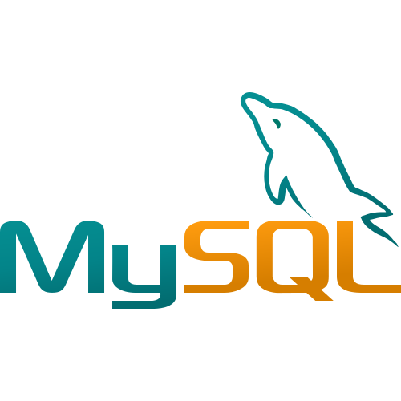

# Hi there! Nice to meet you!

<!-- Personal Details -->
<h3>Your visit is appreciated! 🙌</h3>

I am a software engineer based in Canada🍁. I am passionate about new technologies 💻. I like to learn and use them in different projects 🧑‍💻. I have a master's degree in Applied Computer Science 👨‍🎓. I like to discuss new technologies and ideas.

---

### :books: Recent Blog Posts
<!-- BLOGPOSTS:START -->
 - 💯 [Beyond ‘Hi’: The Case for Meaningful Messaging](https://coding.sahilfruitwala.com/beyond-hi-the-case-for-meaningful-messaging)
 - 💫 [How to read and write Sequential data gracefully in Python](https://coding.sahilfruitwala.com/operate-sequential-data-gracefully-in-python)
 - 🔥 [Upload CSV Data To MongoDB](https://coding.sahilfruitwala.com/upload-csv-data-to-mongodb)
 - 🌮 [A Date With the Datetime Module in Python | Part - 2](https://coding.sahilfruitwala.com/date-and-time-with-python-datetime)
 - 💫 [A Date With the Datetime Module in Python | Part - 1](https://coding.sahilfruitwala.com/get-current-date-in-python)<!-- BLOGPOSTS:END -->

#### Checkout Programming Blogs 👉 [coding.sahilfruitwala.com](https://coding.sahilfruitwala.com)

---

<!-- WHat I am learning? -->
### Technologies I Have Worked With  

&nbsp;
&nbsp;
&nbsp;
&nbsp;
&nbsp;
&nbsp;
&nbsp;
&nbsp;

<!-- WHat I am learning? -->
<!-- ### What am I learning?  

  
&nbsp;
&nbsp;

 -->

### Connect With Me  

<a href="https://bit.ly/3OghAwZ" target="blank">&nbsp;</a>
<a href="https://bit.ly/3JPF6O2" target="blank">&nbsp;</a>
 <a href="https://bit.ly/3uQUjtK" target="blank">&nbsp;</a>
<!-- a href="https://www.instagram.com/sahil_fruitwala/" target="blank"></a> -->
<!--  -->

<!--  -->

 
