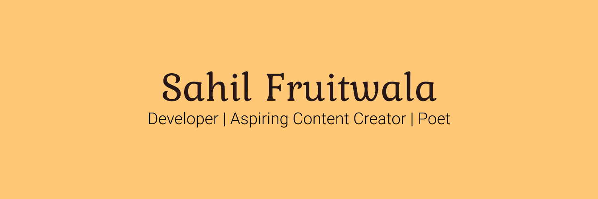
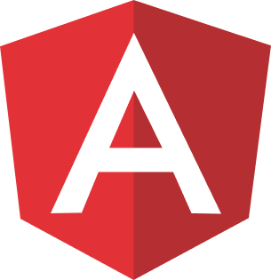

<!-- welcome message -->
<h2>Hi there </h2>

<!-- Personal Details -->
<h3>Your visit is appriciated! 🙌</h3>

I am Sahil Fruitwala, an IT Developer based in Canada🍁. I am passionate about new technologies 💻. I like to learn and use them in different projects 🧑‍💻. I have a master's degree in Applied Computer Science 👨‍🎓. I like to discuss new technologies and ideas.

<!-- More About Me -->
<h3> More about me:</h3>
<ul>
 <li>
I’m currently learning Full stack development 🌱
</li>
 <li>
I’ve some experience in Machine Learning and Web Development 👨‍🔬
</li>
 <li>
Now-a-days, I am writing blogs to help fellow developers and beginners 📝
</li>
 <li>
Reach out to me on <a href="https://www.linkedin.com/in/sahilfruitwala/" target="blank">LinkedIn</a> or <a href="https://twitter.com/Sahil_Fruitwala" target="blank">Twitter</a> 📫
</li>
</ul>

---

<!-- blog starts --> 
### Latest articles
1. [Python 101 Series](https://sahilfruitwala.hashnode.dev/series/python-101)
1. [How to Create and Publish a Package to npm Registry](https://blog.learncodeonline.in/how-to-create-and-publish-a-package-to-npm-registry)
2. [Top 3 Frontend Frameworks in 2021](https://blog.learncodeonline.in/top-3-frontend-frameworks)
3. [How to use Twitter API with JavaScript](https://blog.learncodeonline.in/best-path-to-twitter-api-using-javascript-or-3-clear-steps)
4. [Introduction to Twitter API](https://blog.learncodeonline.in/introduction-to-twitter-api)
5. Data Cleaning 101 [Medium](https://medium.com/analytics-vidhya/data-cleaning-101-b3d29223f256) or [Hashnode](https://sahilfruitwala.hashnode.dev/data-cleaning-using-pandas-1)

<!-- Recent Project -->
### Latest Projects  
* TWI-JS: An NPM package wrapped around Twitter Search API.  
(**In Progress**)  
[NPM Package📦](https://www.npmjs.com/package/twi-js)  
[Repository](https://github.com/SahilFruitwala/twi-js)

<!-- * Note API
**Fron-end:** EJS (Optional)  
**Back-end:** ExpressJS (NodeJS)  
**Database:** MongoDB   
[Repository](https://github.com/SahilFruitwala/mini-projects.git) -->

<!-- WHat I am learning? -->
### Technologies I Have Worked With  

&nbsp;
&nbsp;
&nbsp;
&nbsp;
&nbsp;
&nbsp;
&nbsp;
&nbsp;

<!-- WHat I am learning? -->
### What am I learning?  

  
&nbsp;
&nbsp;

---

### Connect With Me  

<a href="https://twitter.com/Sahil_Fruitwala" target="blank">&nbsp;</a>
<a href="https://hashnode.com/@SahilFruitwala" target="blank">&nbsp;</a>
<a href="https://www.linkedin.com/in/SahilFruitwala" target="blank">&nbsp;</a>
<!-- a href="https://www.instagram.com/sahil_fruitwala/" target="blank"></a> -->
<!--  -->

<!--  -->

 
